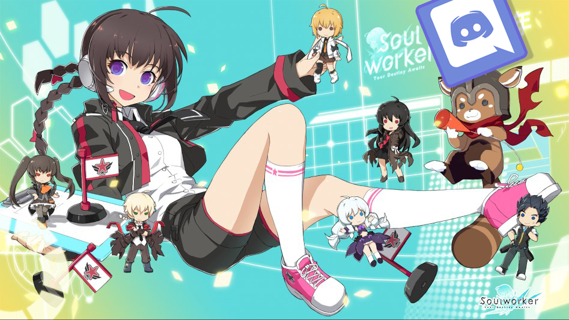

# Discord Soulworker Bot (Chloe) ❤️

   
  
   
   

## 프로젝트 소개

기존에 즐기던 게임이 운의 의존도가 너무 높아져 접게 되면서, 라이언게임즈에서 개발했고 스마일게이트에서 유통 중인 <a href="https://soulworker.game.onstove.com/" target="_blank">소울워커</a>를 시작하게 되었습니다. 이 게임은 3D 최적화가 부족하고, 지금까지 해왔던 게임들에 비해 불편한 요소들이 많긴 합니다. 그래도 게임사가 유저에게 유용한 아이템을 이것저것 퍼주고, 비교적 소통을 잘 하는 것처럼 느껴져, 라이트하게 즐기기 좋은 것 같습니다.

그리고 여기서도 마찬가지로 길드를 만들게 되었는데, 이번에 처음 길드 SNS로 디스코드를 사용하게 되면서 봇을 통해 길드원들에게 가이드를 제공하고자 했습니다. 얼마 없는 카툰 렌더링 게임임에도 불구하고 신규 유저가 적고, 인게임 가이드도 많이 불친절한 편이라 아쉬운 마음에 만든 것도 있습니다.

 

 

## 기술 스택

|         python (구현)          |         heroku (배포)          |
| :----------------------------: | :----------------------------: |
|  |  |

 

## 구현 기능

- 명령어를 인식해서 가이드 제공 (육성법, 스킬 찍는 법 등)
- 월드보스, 길드(리그) 컨텐츠 시간 타이머 (자동 알리미)

 

## 후기

프로젝트를 진행할 때는 신규 유저와 길드원이 많이 늘어날 거란 기대를 하면서 열심히 만들었습니다. 그런데 신규 유저의 유입은 아예 없었습니다. 그래도 초반에는 길드원분들이 많이 이용해주시고, 피드백을 해 주셔서 아쉬움은 남지만 그래도 좋았습니다. 나중에 기회가 되어 디스코드 봇을 다시 만들 일이 있으면, 이번 경험을 살려 널리 사용될 수 있는 봇을 만들어 봐도 좋을 것 같습니다.

 

## 라이센스

MIT &copy; [NoHack](mailto:lbjp114@gmail.com)
